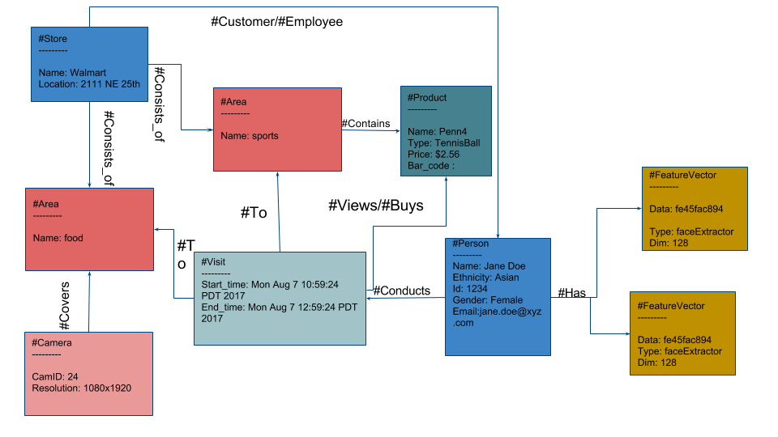

# Schema Definition

The VDMS API provides a way to add entities in a system relevant to an application,
though it is important to remark that ***no schema declaration is needed upfront***.

The schema is application dependent, and can evolve over time.
For example, if we are building a visual pipeline for a retail store that will
analyze customer behavior.
One could imagine entities like Customer, Object,
Department, and Employee. In addition, there could also be more conceptual
entities like a Visit to indicate a customer's visit to the store, a feature
vector representing a customer's features to enable in person reID, the actual
video snippets captured by cameras, and so on.
Each of these entities could have their own properties, either known at the start of the
application or added over time. For example, a department could have a name,
information about its physical location in the store, camera(s) installed
overhead, and other things like description. An object could have an RFID tag
associated with it, a type indicating whether it is a ketchup bottle or towel
and so on.

Here is an example of what a schema would conceptually look like
in an "Analytics for Retail" use case:

