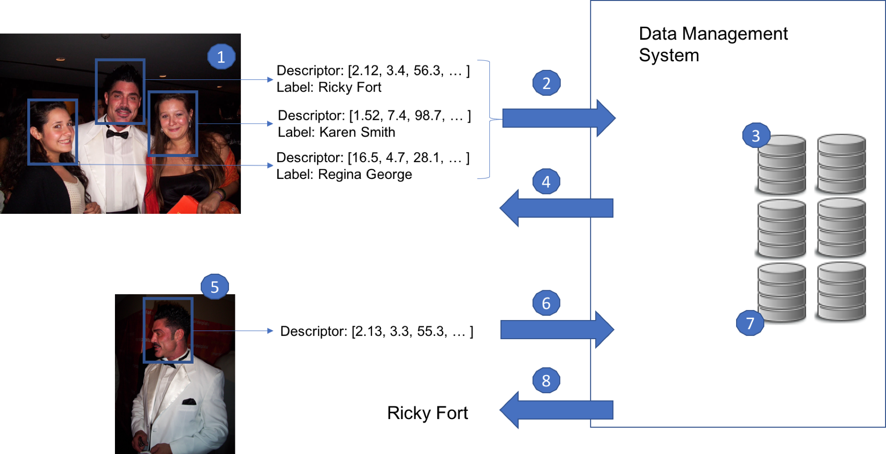

# Descriptor Tutorial

Let's walk through an example on how VDMS would support visual descriptors for your application. In this tutorial, we will implement an VDMS instance for storing and matching faces. In this instance, we will store photos, descriptors, and metadata about a series of pictures that were taken at a party.

We will start by storing the photos taken during the party. If a picture has a face on it, we will also store the descriptor of the faces, along with a label indicating which person that descriptor belongs to. That will allow us to later query for a face that was not previously labeled, and get the right label indicating who that person is, among other cool queries.

We will follow the use-case of face recognition as our example application, following Figure 1:

<!-- 

   
  **Figure 1: Face Detection and recognition example.**

  -->

Here we details what happens on each step on Figure 1.

1. The application runs a descriptor extractor for faces over a photo with people, obtaining one descriptor for each person.

2. The descriptors are sent to VDMS, along with the original photo, in a single transaction.

3. VDMS stores the descriptors within a transaction placing them in the appropriate index, following statistical properties of the set of descriptors.

4. VDMS acknowledges the transaction to the user application.

5. Another user application want to query who is the person on a new photo. For that, the application use the same extractor to obtain a descriptor of the face.

6. The query is sent to the data management system as a new transaction.

7. VDMS preforms a neighbor search using the persistent index.

8. VDMS returns the label corresponding to that descriptor as part of the transaction.

Note:
In our example, Steps 1 through 4 will happen every time we want to insert a new image to VDMS, Steps 5 through 8 will happen every time we want to classify a new face.

We will also cover other forms of searching over the descriptors, not shown in this Figure.

## DescriptorSet Creation

Before inserting any descriptor to VDMS, we will create the DescriptorSet. When creating a DescriptorSet, we specify the name that will be assigned to that set, the metric that will be used for searching, and the dimensions of the descriptors that will be inserted in the set:

    "AddDescriptorSet": {
       "name": "party_faces",   // User-defined name of the Set
       "metric": "L2",          // Specify the metric (Euclidean distance)
       "dimensions": 128        // Specify dimensionality (128 float)
    }

## Insert a new photo with associated metadata and descriptors

The user will run its favorite face detector over the photo and extract the location of the photos where there are faces. The user will then use its favorite descriptor extractor (details about the magic behing recognition and extraction here). This is Step 1 in Figure 1.

Once each of the faces has its corresponding descriptor, we will assume that the user will label each of them and assign the name of the person for that face, along with some other metadata (like gender or age).

With all that metadata in place, we will proceed to store the information (image, labels, metadata) into VDMS in a single transaction (Step 2 through 4 in Figure 1):

    "AddImage": {
        "properties": {             // Specify user-defined properties
            "name": "photo_party_01",
            "location": "John's House",
            "year": 2015
        },
        "_ref": 1,                  // Assign a reference number for later use
        "format": "jpg"             // Specify a format to use (default is our TDB format)
    }

    "AddDescriptor": {
        "set": "party_faces",       // Specify the name of the Set
        "label": "Ricky Fort"       // Assign a label to the descriptor
        "properties": {             // Add application-specific properties
            "gender": "M",
            "age": 45
        }
        "link": {                   // We can create a connection between the image
            "ref": 1                // and the descriptor.
        }
    }
    "AddDescriptor": {
        "set": "party_faces",       // Specify the name of the Set
        "label": "Karen Smith"      // Assign a label to the descriptor
        "properties": {
            "gender": "F",
            "age": 24
        }
        "link": {
            "ref": 1
        }
    }
    "AddDescriptor": {
        "set": "party_faces",       // Specify the name of the Set
        "label": "Regina George"    // Assign a label to the descriptor
        "properties": {
            "gender": "F",
            "age": 32
        }
        "link": {
            "ref": 1
        }
    }

    +
    Blob                            // a blob with the image and descriptors
                                    // will be passed to our client library.
                                    // The blob in this case is an array of 4 objects:
                                    // The first is the encoded image
                                    // (using jpeg or png, for example)
                                    // The other 3 objects are the descriptors
                                    // (each one is an an array of 128 floats)

Note: Single vs Multiple Transactions

In this example, we insert all the information of a photo (the faces on that photos, the descriptors of those faces, and other metada) within a single transaction. We could also insert the photo in a separate transaction, and still be able to link the descriptors with the photos. Check the full API to understand that case better.

## Classify a New Face

Suppose we have a photo of a person that was on the party, but we don't know who that person is (photo on the bottom of Figure 1).

We can run the face detection over the photo, and run the descriptor extractor over the region of the photo that contains the face (Step 5 on Figure 1).

Now that we have the descriptor for that person, we can ran a classification query to see if we have a close match based on the descriptor.

    "ClassifyDescriptor": {
       "set": "party_faces",
       "k_neighbors": 1,          // We specify that we want a classification
                                // based on the nearest neighbor
    }
    + blob                      // The blob is passed using the client library.
                                // In this case, it will be an array with the values :
                                // [2.13, 3.3, 55.3, ...]

VDMS will perfom the similarity search, and classify the input descriptor based on the closest neighbor.

Naturally, the closest neighbor will be the descriptor corresponding to "Ricky Fort", and the response will look like this:

    "ClassifyDescriptor": {
        "status": "success",
        "label": "Ricky Fort"
    }

## Query Using User-defined Properties

We can also perform queries to find descriptors that have some specific properties.

For instance, suppose that we want to get all the descriptors from people that have certain age, as we are interested in studying some particular characteristics of those descriptors.

We can run that query by doing:

    "FindDescriptor": {
        "set": "party_faces",           // Specify the descriptor set
        "constraints": {
            "age": [">=", "30"]          // We want only those which correspond to people
        },                              // 30 years or more older.
        "results": {
            "list": ["age", "gender"]   // We want some properties to be returned
        }
    }

In this case, VDMS will return:

    "FindDescriptor": {
        "status": "success",
        "entities": [
            {                       // Ricky Fort
                "age": 45,
                "gender": "M"
            },
            {                       // Regina George
                "age": 32,
                "gender": "F"
            }
        ]
    }
    + blob                          // The blob is returned using the client library.
                                    // In this case, it will be an array with the values :
                                    // [2.12, 3.4, 56.3, ...](Ricky) and
                                    // [16.5, 4.7, 28.1, ...](Regina)

## Query Using a Descriptor

We can also perform queries to find descriptors that are similar to some "query" descriptor.

For instance, suppose that we want to get all the descriptor that is the most similar to:

    [16.6, 4.9, 27.8, ...] (query descriptor)

We can run that query by doing:

    "FindDescriptor": {
        "set": "party_faces",       // Specify the descriptor set
        "k_neighbors": 2,             // We specify that we want only the two nearest neighbor
        "radius": 243.434,          // We specify max distance we want this
                                    // descriptor to be from the query
        "results": {
            "list": ["_label",      // We want the label assigned to that descriptor
                     "gender",      // its gender
                     "_distance"],  // and its distance to the query descriptor
            "blob": False    // We specify that in this case,
                                    // we don't want the actual descriptor to be returned.
        }
    }

    + blob                          // The blob is passed using the client library.
                                    // In this case, it will be an array with the values :
                                    // [16.6, 4.9, 27.8, ...] (the query descriptor)

Naturally, the closest neighbor to that query descriptor will be the one that corresponds to Regina George's face.

Assume that the descriptor for Karen Smith also falls within that radius range.

In this case, VDMS will return:

    "FindDescriptor": {
        "status": "success",
        "entities": [
            {
                "_label": "Regina George",
                "gender": "F",
                "_distance": 34.342
            },
            {
                "_label": "Karen Smith",
                "gender": "F",
                "_distance": 287.345
            }
        ]
    }

## Complex query using connections

Assume we want all the photos that where taken in 2015 and that had a face with the following descriptor on it:

    [16.6, 4.9, 27.8, ...] (query descriptor)

We can run that query by doing:

    "FindDescriptor": {
        "set": "party_faces",       // Specify the descriptor set
        "radius": 243.434,          // We specify max distance we want this
                                    // descriptor to be from the query
        "_ref": 1,                  // We will use this reference in the
                                    // FindImage call (see below)
        "results": {
            "list": ["_label",      // We want the label assigned to that descriptor
                     "gender"],     // and the gender property
            "blob": False    // We specify that in this case,
                                    // we don't want the actual descriptor to be returned.
        }
    }

    "FindImage": {
        "constraints": {
            "year": ["==", 2015]
        }
        "format": "jpg",
        "link": {
            "ref": 1,               // We reference to the result of
                                    // the FindDescriptors call above
        }
    }
    + blob                          // The blob is passed using the client library.
                                    // In this case, it will be an array with the values:
                                    // [16.6, 4.9, 27.8, ...] (the query descriptor)

Naturally, the closest neighbor to that query descriptor will be the one that corresponds to Regina George's face.

Assume that the descriptor for Karen Smith also falls within that radius range, but not the one associated with Ricky Fort.

In this case, VDMS will return:

    "FindDescriptor": {
        "status": "success",
        "entities": [
            {
                "_label": "Regina George",
                "gender": "F"
            },
            {
                "_label": "Karen Smith",
                "gender": "F"
            }
        ]
    },
    "FindImage"{
        "status": "Success,
    }
    + blob                      // The blob is returned using the client library
                                // In this case, the image named "photo_party_01"
                                // will be returned as an encoded jpg.

