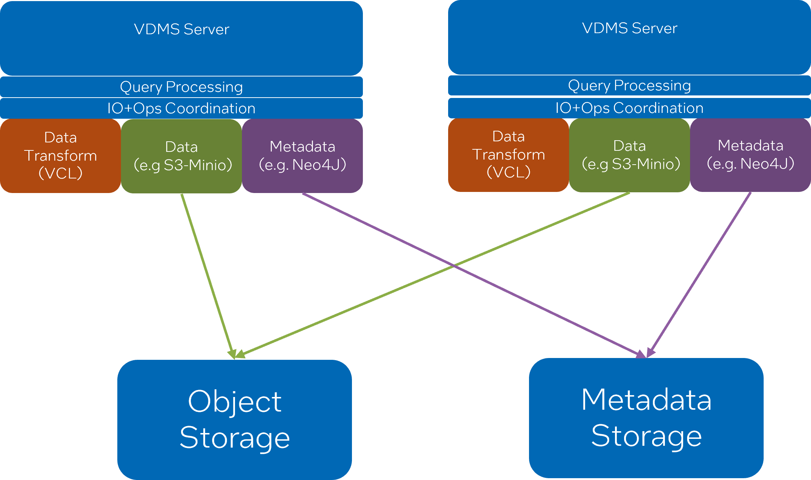

# Overview

One of the challenges with prior incarnations of VDMS was requiring external coordination for distributed capabilities. While this did make it so certain operations could scale, it was brittle in its resiliency, required careful monitoring of VDMS nodes, client-side coordination, limited data and metadata sharing, and it was difficult to expand the cluster at runtime.

Our solution is to leverage our modular handler design to incorporate a new handler that communicates with Neo4J for its metadata needs, and makes use of existing S3 capabilities for data storage. By decoupling data storage, metadata storage, and data transformations we can now scale these independently of one another. In effect, the VDMS server becomes an operations area for data transformations and coordinates the storage of data and metadata to S3 and Neo4J.

If more operations throughput is needed, we can simply add a new VDMS server that “points” to the S3 and Neo4J clusters and the new server will automatically have access to all data and metadata that’s already been pushed. Similarly, if we need more data or metadata capabilities the S3 and Neo4J clusters can be independently scaled.



# Caveats
The Neo4J based VDMS is an experimental feature. Its calls ([NeoAdd](../../commands/NeoAdd.md) and [NeoFind](../../commands/NeoFind.md)) while functional, are limited in scope to metadata and image operations. The API calls and feature itself should be treated as unstable, and there may be bugs and instabilities as a part of using this feature.


# Configuring and Running distributed VDMS

Note that these instructions apply to every server you start.
For configuration, make sure your config file specifies the query_handler as `neo4j`”` and that you specify the use of AWS as the storage type, as well as the target bucket. E.g.
```json
{
    "port": 55555,
    "storage_type": "aws", //local, aws, etc
    "bucket_name": "minio-bucket",
    "query_handler" : "neo4j",
    "use_endpoint" : true,
    "endpoint_override": "http://<target_ip>:9000",
    "more-info": "github.com/IntelLabs/vdms"
}
```

You must also specify the credentials and endpoint for neo4j with the following environment variables:

```
export NEO4J_USER=neo4j_user
export NEO4J_PASS=neo4j_password
export NEO4J_ENDPOINT=neo4j://<target_ip>:<target_port>
```

For MinIO connectivity, you can specify credentials using environment variables.

```
export AWS_ACCESS_KEY_ID=my_acc_key
export AWS_SECRET_ACCESS_KEY=my_sec_key
```

Or you can use AWS credentials as [specified here:](../Remote-Storage-in-VDMS.md)

# Deploying Neo4J and MinIO for testing

If you have access to docker, you can deploy MinIO and Neo4J containers to connect your VDMS deployments to, e.g

```bash
docker run \
-d \
-p 9000:9000 \
-p 9001:9001 \
--name minio_tester \
-e "MINIO_ROOT_USER="minio_username \
-e "MINIO_ROOT_PASSWORD="minio_password \
quay.io/minio/minio server /data --console-address ":9001"


docker run \
 -d \
--name=4j_container \
--env NEO4J_AUTH=<neo4j_user>/<neo4j_password> \
--publish=<neo4j_port>:7687 \
neo4j:5.17.0 \
```

# Deploying Multiple VDMS servers

Its possible to deploy multiple VDMS servers sharing the same backend infrastructure, however note that if you are using a load balancer along with descriptor set functionality you may have unpredictable behavior as descriptor sets are currently restricted to local filesystem access. If you wish to use descriptor sets with multiple distinct VDMS servers you must track which server is responsible for each descriptor set.

Assuming the Neo4J and S3 object storage clusters are up and running, its simply a matter of making sure the configuration file and environment is correctly set and starting a new server. Once its up and running, it can share the same data/metadata environment as all other servers. The VDMS server, however, will not have any awareness of other servers natively (i.e. it is stateless), nor will it require any. Each server can be interacted with as though it were a standalone deployment, or they can be routed to via a load-balancer.
