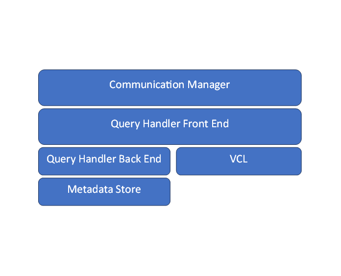

# Query Handler Development

This page is intended primarily for developers who may want to either modify existing query handlers (e.g. changing data and operations flow) or develop entirely new handlers from scratch, e.g. enabling a new type of metadata backend. The data information below provides a basic overview of the architecture and pointers to examples for developing your own query handler.


## Overview

The VDMS query handler is the portion of VDMS that takes in client requests and does the "work" of converting that into metadata operations and coordinating with VCL for corresponding operations (e.g. Image resize, video format changes, etc.) on upload and download.

Different query handlers can be selected at server start time to change the behaviors and flow of VDMS. Currently we only fully support PMGD backend, and have a "Hello World" example as an alternate backend for testing and demonstration purposes. We are exploring a Neo4J based metadata storage backend.

## Available Query Handlers

Currently there are only 2 available query handlers:

* `pmgd`: This is the primary default handler for PMGD, fully supporting the primary API with a graph database backend, as well as support for autoreplicate and delete features.
* `example`: This is a simple stub handler that simply echoes hello-world back to the caller regardless of the contents of the API.


## Selecting Query Handler

To select what query handler is used, inside the VDMS configuration file, add in
```json
"query_handler": "query_handler_name"
```

If none is specified, it will default to the PMGD based query handler.


## Query Handler Architecture



At an architectural level, the query handler takes in a connection object from the communication manager, extracts the message, and then proceeds to "process" it. This includes any operations with the VCL, writing to local storage, and interactions with any "backends" for operations such as metadata storage, and creating a response to send back.

In practice we have created a base query handler class that allows derived classes to selectively inherit commonly used methods (e.g. "process connection") and requires `process_query` implementation to be valid. Process query is responsible for implementing all logic and calling relevant VDMS query operations, though as we shown in the QueryHandleExample class, the minimum valid query processing simply requires a valid protobuf (which can be written with JSON) be written to the response variable, and does not have any backend or VCL connections.

### _QueryHandlerBase (Front End)_

The query handler frontend handles coordination between the communication manager, as well as implementing/calling any relevant operations dictated in the protobuf it has received.

The QueryHandlerBase class is the common base from which all other query handler frontends are derived. It contains the following:
* A virtual cleanup query method, which can be used as a helper to remove dangling images and videos from a failed transaction.
* A pure virtual `process_query` method, which is where most the front end logic should be implemented.
* And a virtual `process_connection` method to hand the receiving and sending of the protobufs to the communications manager. This can be inherited or optionally overridden.

### _QueryHandler Initialization:_

Different query handler implementations may have static state affiliated with a particular class instance. For example, the PMGD handler initializes a special lookup map (`_rs_cmds`) to handle different operations. This initialization is called at server start. We’ll describe the various "touch points" in the following section which describes how to implement and integrate a new query handler in slightly more detail.

### _QueryHandlerBackends:_

Backends add additional logic for interacting with like graph databases for metadata. For example, we have a separate PMGDQueryHandler which handles all interactions with the PMGD instance for storing graph metadata.

Note that a backend is not necessarily required, as all logic may be included in the front end handler. However, we encourage developers to logically separate them to reduce code complexity.

### _QueryHandler Example_

Implementing a query handler requires a few basic touch points.

A derived class must be implemented, with minimally the `process_query` method implemented. A barebones example of this is shown with queryhandlerexample.h/queryhandlerexample.cc

Any static state required for initialization should be called from the server.cc source file (you can see there is an if-else chain that selects the correct query handler).

The communication manager will need to have the  query handler instantiation added to its selection logic (see the `process_queue` method).
Finally, the CMakeLists.txt file will need to be updated to include the additional source files.

All told you should expect to modify 2 files (server.cc and communication manager.cc) and add a minimum of 2 new source files (header + implementations of your derived class).

As a final note, it is the responsibility of the query handler to ensure transactional semantics are maintained. That is, failures during processing of a VDMS command should lead to a roll back of all metadata and data changes.


