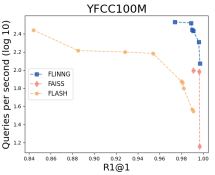
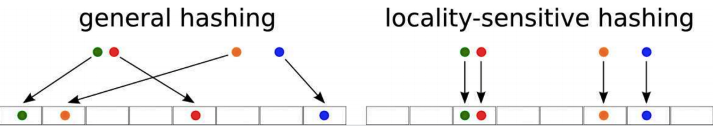
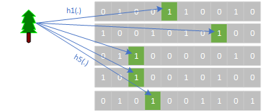
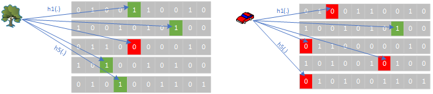
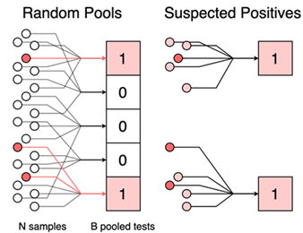
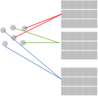
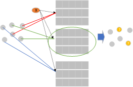
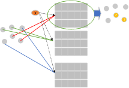
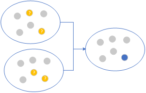
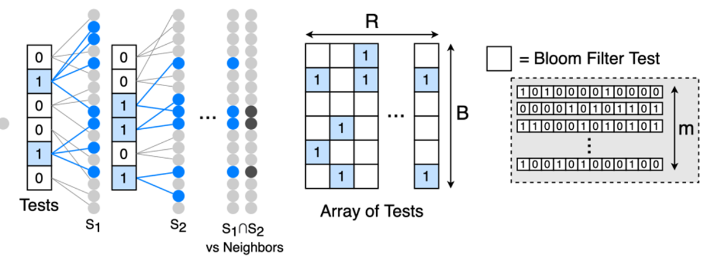

**Filters to Identify Near-Neighbor Groups (FLINNG)** is a near neighbor search algorithm, for more detailed description and results please refer to the paper [Practical Near Neighbor Search via Group Testing](https://arxiv.org/pdf/2106.11565.pdf).   

# FLINNG Library and VDMS
FLINNG is an indexing Library for feature vectors of D dimensions each. It provides functionality to add vectors, search and retrieve vectors and similarity search (return nearest neighbors) to a given query vector. It provides similar functionality to [FAISS library](https://github.com/facebookresearch/faiss) supported by VDMS.

## When To Use FLINNG Library as Opposed to Other Libraries Supported by VDMS

FLINNG should be used when the number of dimensions in the dataset is huge (curse of dimensionality) (e.g., >1000 dimension). In this case, dimension-reduction can hurt the accuracy of the returned result for near-neighbor search performance. FLINNG will have lower accuracy compared to other libraries when the number of dimensions is small.
The library is also attractive when the expected total number of items in the index is huge (e.g., billions of vectors).

## FLINNG Library Limitations:
1. FLINNG works best on high-dimensional search tasks where the neighbors are all above a (relatively high) similarity threshold. It is not the best choice for problems such as k-NN classification, where low-similarity results may be important.
2. Current implementation of the library expects the dataset to be **normalized** (i.e., dataset ranges between 0 and 1),

## Distance Metrics Supported by FLINNG Library:
FLINNG currently supports two distance metrics: Inner Product (cosine similarity) and Euclidean (L2) distance metric.  

# VDMS and FLINNG Library API
FLINNG supports the same standard API for indexing, searching, and retrieving feature vectors similar to other libraries in VDMS. The entire list of API is defined in DescriptorSet.cc and DescriptorSet.h.

1) **`VCL::DescriptorParams* param = new VCL:: DescriptorParams(numrows, cellsperrow,  numhashtables, hashespertable,  subhashbits, cutoff=6)`:**
Used to create a new set of parameters for the library to be passed to the construction function to create an index. Setting the parameters will be covered later in this wiki.

2) **`DescriptorSet(path, dim, engine, distance metric,  *parameters)`:**
The construction function creates a new index collection (if it does not exist) to be stored in the path supplied, supporting feature vectors with `dim`, dimensions per descriptor. To use FLINNG, the engine should be set using `eng=flinng` (default is FaissFlat), with the specific metric of choice whether L2 or IP (default is L2), and the last argument is a pointer to the parameters created in step 1.

3) **`add_and_store(float* X, n_descriptors, long* labels)`:**
Adds an array of vectors, `X`, (d dimensions each) to the index. The total number, `n_descriptors`, of items are added (i.e., total size of X=d*num). The original dataset is stored in parallel in a data structure for subsequent retrieval of original data (if needed), and the labels if provided will be stored as well.

4) **`add(float* X, n_descriptors, long* labels)`:**
Same as above but it only indexes the descriptors and does not store the original data set. This is for use cases where the user is only interested in retrieving the IDs of top-k neighbors but not feature vectors corresponding to these themselves.

4) **`search(float *Q, unsigned n, unsigned K, long *ids)`:**
Searches the index using an array of vectors `Q` (d dimensions each). The total number of queries `n` (i.e., total size of Q=d*n). Nearest `K` neighbors will be returned in the array of vectors `ids`.

5) **`search_with_distance(float *Q, unsigned n, unsigned K, long *ids, float *distances)`:**
Similar to the search API but will also return the inner product (IP) or L2 distance, based on the metric defined when the index is created, of each of the nearest `K` neighbors in the array distances.

6) **`radius_search(float* query, float radius, long * descriptors, float* distances) `:**
Radius search is not supported by FLINNG library.

7) **`classify(float* descriptors, unsigned n, long* ids, unsigned quorum)`:**
Searches the index using an array of vectors `Q` (d dimensions each), the total number of queries `n` (i.e., total size of Q=d*n), and then return a label to each query (i.e., classify) which is corresponding to the majority vote of the labels among each query Nearest K neighbors.

8) **`finalize_index()`:**
This function is called after finishing the insertion of items in an index (i.e., after using `add()` or `add_and_store()`) to prepare the index for query (i.e., `search()` or `search_with_diance()`). Data items can be inserted incrementally using as many invocations of `add()` (or `add_and_store()`) as needed, but for the query results to be correct the function `finalize_index()` must be called first. Otherwise, query results will not be correct. User does not have to call this function explicitly. When a search function is called, a flag is checked if the index has not been already finalized and will act accordingly

9) **`write_index(const char *fname)`:**
Stores the index to a file.

10) **`read_index(const char *fname)`:**
Reads an index from a file.
  

# FLINNG Library Parameters
FLINNG library parameters are defined in `DescriptorParams.h`. They can be set by the user before creating the index as we defined in the previous section. The default parameters are set for feature vectors of 4K dimensions and 10M total number of items in the index.  Users can refer to implementation details section (Section 6) in the paper [Practical Near Neighbor Search via Group Testing](https://arxiv.org/pdf/2106.11565.pdf) for a discussion of the library parameters.

The most important parameter to tune given a dataset is `num_rows`. The query time (and similarly indexing time) is linearly proportional to this parameter. The returned query accuracy is asymptotically increasing with  `num_rows`. Due to the nature of the algorithm that depends on hashing, it is not strictly increasing. Sometimes increasing `num_rows` can decrease the accuracy for that value, but if `num_rows` increased further it will regain back the accuracy.

The `cells_per_row`, `num_hash_tables` and `hashes_per_table` will all affect the accuracy but the default parameters should work with most use cases.
We are also working on a standalone VDMS autotune tool (will be released in the future) that can help guide users on how to set the parameters of the different libraries supported by VDMS (FAISS, FLINNG, etc.) given a dataset of certain dimensions and probability distribution.   

# Sample of Performance
{: .center style="height:250px"}
<!-- 

 -->
<!-- [[/images/FLINNG/performance.png|FLINNG Sample Performance]] -->
<!-- <figure><figcaption>FLINNG Sample Performance</figcaption></figure> -->

Testing on YFCC100M dataset with 4K dimension each, the figure shows a typical query time for R1@1 accuracy for FLINNG compared to other algorithms. FLINNG was 3.4 times faster than FAISS (IVF Flat Index) at the 0.99 recall level on YFCC100M with an order of magnitude faster indexing time for the dataset.  

# FLINNG Algorithm Overview
Since our goal is to perform an approximate search, dimensionality reduction is a reasonable strategy. However, dimensionality reduction is costly for ultra-high dimensional data. Dimensionality reduction can incur a performance penalty, so we may wish to perform the near neighbor search over the original metric space.

FLINNG addresses the computational challenges of high-dimensional similarity search by presenting an index with fast construction time, low memory requirement, and zero query-time distance computations. The approach is to transform a near neighbor search problem into a group testing problem by designing a test that outputs “positive” when a group of points contains a near neighbor to a query. That is, each test answers an approximate membership query over its group.

FLINNG combines two ideas (1) group testing with (2) locality-sensitive hashing (LSH). The basic concept here is to reduce near-neighbor-search problem to a group testing problem, where near neighbors are “positives,” and far neighbors as “negatives,”. Then do a series of membership queries using group testing to refine our set of near neighbors to the required number.  

### **Locality-Sensitive Hashing (LSH):**

A hash function `h(x) -> {1, ..., R}` is a function that maps an input `x` to an integer in a given range. Traditional hash functions (e.g., CRC, murmur hash, etc.) output will be completely uniform to minimize collisions (two inputs having the same hash) across inputs.

<!-- [[/images/FLINNG/lsh.png|]] -->
<!-- <figure><figcaption>Locality Sensitive Hashing</figcaption></figure> -->

Locality sensitive hash (LSH) similarly uses a hash to map inputs to an integer (or a bucket index), however, LSH hash functions are specifically designed so that hash value collisions are more likely for two input values that are similar or close together (within a certain distance, e.g., cosine, hamming, Euclidean, etc.). The best hashing function to be used is domain-specific and depends on the distance metric and the nature of the dataset (dimension size, dense, sparse, etc.)   

### **Distance Sensitive Bloom Filter Using LSH:**

<!-- <figure><figcaption>Bloom Filter</figcaption></figure> -->

A Bloom filter is a widely used data structure for representing a set `S` and answering membership queries "Is `x` in `S`?" with allowing some false positive. As shown in the figure, Bloom filters use hash functions to set bits in one or more vectors of bits. Given a set `S`, each item in `S` is hashed and the bits corresponding to each element are set in the bloom filter vectors. When answering a membership query for a new input `X`, it is hashed using the same hash functions and the indices pointing to the hash functions are checked. If all the locations are set to 1, then with a very high probability `X` belongs to the set `S`. If any of the locations is 0, then with probability=100%, this item does not belong to the set. As shown in the figure, all bits corresponding to the tree input are 1's which indicates that the tree is a member of the set with a very high probability. Because of hash collisions, false-positives are possible but false-negatives are not possible. The false positive rate is a function of the randomness of the values generated by the hash functions, the total number of items in a set `S`, number of hash functions used, and the length of the bloom filter.

<!-- <figure><figcaption>Distance Sensitive Bloom Filter</figcaption></figure> -->

Kirsch et. al. ([“Distance-sensitive bloom filters”. In ALENEX'06](https://epubs.siam.org/doi/10.1137/1.9781611972863.4)) presented an extension of the traditional Bloom filter using LSH. Distance-sensitive bloom filters replace regular hash functions in the traditional bloom filters with LSH functions and answer queries of the form, “Is `x` close to an element of `S`?”. The distance-sensitive Bloom structure consists of `m` binary arrays that are each indexed by an LSH function. When using LSH, the relative Hamming distance between two Bloom filters (of the same size and created with the same hash functions) can be used as a measure of the similarity of the underlying sets. As shown in the figure, when using a tree as an input (different than the original tree but has some similarity) and using LSH hashing functions, the number of locations set compared to the original tree is larger than when using a car as input and compare that with the original tree (4 out of 5 in the case of a similar tree and 1 out of 5 in the case of a car which has no similarity). As a result, using a fixed threshold (e.g., t ≤ m of the bits are set), distance-sensitive bloom filters can answer similarity membership queries.
  

### **Group Testing (GT):**

<!-- <figure><figcaption>Group Testing</figcaption></figure> -->

The idea of Group Testing (GT) is to identify the set of defective items in a set of objects. Typically, the number of defective items is << than the total set of objects. The aim is to perform detection with the fewest possible number of tests without the need to test each object by itself. GT will randomly group all N objects into P pools and then test at the pool level with one test “Does the pool contain at least one defective?”. A pool test corresponds to an OR function among the variables of the group, i.e., it returns 1 if any of the pool members is 1 and returns 0 when all pool members are 0. As shown in the figure, all members of a defective pool are suspected as defective. Repeating the random pooling of objects multiple times and taking the intersection of defective pools, the defective items can be identified. The testing stops when the required size of the defective set is achieved or it remains constant without shrinking for a threshold of subsequent pooled tests.
  

## FLINNG Toy Example:

FLINNG combined the ideas of distance-sensitive bloom filter with group testing to answer the  KNN problem. It uses a distance-sensitive bloom filter to identify a set of M neighbors and then use group testing to shrink the M down to K. To explain the high-level idea of the FLINNG algorithm, we can use a toy example for a KNN query on a very small dataset.

**1) Problem Statement:**

<!-- <figure><figcaption>Problem Statement</figcaption></figure> -->

As shown in the figure, if we assume that the original dataset has 6 items, then given a query `X`, we want to return the closest (`K=1`) item to it in the dataset (blue dot shown in the figure).

**2) Indexing in a distance-sensitive Bloom filter:**

<!-- <figure><figcaption>Indexing</figcaption></figure> -->

FLINNG creates random pools of the data items and indexes them in an array of distance-sensitive bloom filters using LSH hash functions. As shown in the figure in the toy example, a random 3 pools (2 items each) are created, then each pool (red, green, and blue) of items is inserted in its distinct distance-sensitive bloom filter.

**3) Query with X, which Pools are suspected to have close neighbors to X:**

<!-- <figure><figcaption>Query</figcaption></figure> -->

Given a query `X`, and using the same LSH hashing functions, `X` is checked across each distance-sensitive bloom filter and the pool of items that returns positive will contain a neighbor (similar enough) item to `X`. As shown in the figure, in the toy example, when the green pool returns as positive, the two items who are members in the green pool are suspected to be close neighbors to `X`.

**4) Repeating with a new set of random pools**

<!-- <figure><figcaption>Repeating Query</figcaption></figure> -->

Repeating steps 1-3 across a new set of random pooling of items, to create sets of "suspected" close neighbors. For example, in the figure, with a new different random pooling of items a new set of suspects (red pool in the figure) are identified as possible neighbors of `X`.

**5) Group Testing to find the set of K nearest neighbors: (I.e., frequency counting)**

<!-- <figure><figcaption>Frequency Counting</figcaption></figure> -->

As previously discussed, using the concept of group testing, the pools of suspected neighbors are intersected together until `K` neighbors are identified. As shown in the figure, in the toy example, intersecting the two suspected pools out of the two iterations of random pooling, the nearest neighbor is the common item that is repeated across the two pools (blue dot).

**6) Putting everything Together**

<!-- <figure><figcaption>Everything Together</figcaption></figure> -->

Although for the toy example we described FLINNG using a sequential set of rounds of tests, random pooling and test for neighbors can be performed in parallel. In general, FLINNG split a given dataset `D` into a set of groups, which we visualize as a `B × R` grid of cells. FLINNG randomly distributes the item in `D` across the `B` cells (pools) in each row, so that each cell has the same number of points. This can be done by randomly permuting the elements of `D` and assigning blocks of `N_b` elements to each cell using modulo hashing.

Given a query, the algorithm produces a `B × R` array of group test results that can be efficiently decoded to identify the nearest neighbors. To query the index with a point `y`, FLINNG begin by querying each classifier (the classifier here is a distance-sensitive bloom filter). If `Cr,b(y) = 1`, then at least one of the points in `N_b` has a high similarity to `y`. FLINNG collects all of these “candidate points” by taking the union of the sets for which `Cr,b(y) = 1`. It repeats this process for each of the `R` repetitions to obtain `R` candidate sets, one for each column in the grid.

With high probability, each candidate set contains the true neighbors, but it may also have some non-neighbors that were included in `N_b` by chance. To filter out these points, it intersects the candidate sets (group testing) to obtain the approximate near neighbor set `K`. In general, each repetition reduces the number of candidates by a factor of `1/B`, which decreases exponentially with the number of repetitions. FLINNG progressively rules out more and more candidates until it is left with only the near neighbors.
 

**The advantage of FLINNG is that it identifies the near neighbors using group testing, without explicitly storing the data or performing any distance computations. Thus, it is independent of the original dimension of the data (only the hashing cost is proportional to the data dimension).**

<!-- https://github.com/tonyzhang617/FLINNG/wiki -->
