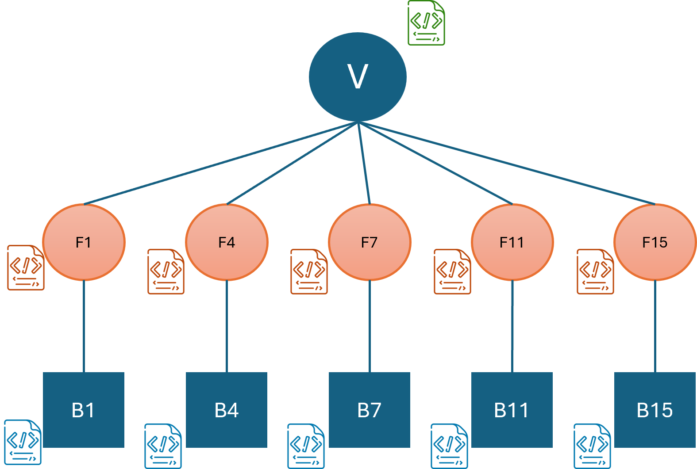

# Dynamic Metadata Addition for Images/Videos

In addition to adding metadata as properties to Images and Videos, user-defined functions can also be used to add metadata dynamically. These metadata information will be added as entities to the image/video along with any regions of interest and related information. Note that metadata can only be added with an AddImage/AddVideo query.

Assume a use-case where a user wants to add videos to VDMS and add two types of metadata. One is the metadata that they already know, which are included in the `properties`. The other category of metadata are the ones that need to be extracted by running some operations on the videos. For this example, we assume the user wants to extract bounding box for faces and bounding boxes for red cars in the videos. Then the user would expect a data store graph as shown in the figure below. The video, which has its own properties is linked with an edge to all the frames that have relevant metadata and each frame is linked with an edge to bounding boxes.



The user would write two UDFs for the two types of dynamic metadata as described in [User Defined Operations](User-Defined-Operations.md). If they want to execute these operations on a remote server then they need to follow the [Remote Operations](Remote-Operations.md) guide. We have included dummy user-defined operations in the `remote_function` and `user_defined_function` directories, both with the name `metadata.py`.

Note that the return is different than the standard user-defined operations for the metadata operations as VDMS also requires the extracted metadata from the operation.

Once the user-defined operations are running, the user can run the following query to add the video and dynamically add the metadata to VDMS.

```
AddVideo {
    "properties": {
        "name": "video_activity",
        "category": "example"
    },
    "operations": [
        {
            "type": "userOp",
            "options": {
                "id": "facemetadata",
                "port": 5555
            }
        },
        {
            "type": "remoteOp",
            "url": "http://127.0.0.1:5123/video",
            "options": {
                "id": "carmetadata",
                "color": "red"
            }
        }
    ]
}
```

The find query for the image/video works normally, unless the user also requires the metadata information in the response. In order to receive metadata information, a three level query should be made as shown below.

```
query = [
        {
            "FindVideo": {
                "_ref": 1,
                "constraints" : {
                    "category" : ["==", "example"],
                }
            }
        },
        {
            "FindVideo": {
                "_ref":2,
                "frameconstraints" : {
                },
                "link":{
                    "ref":1
                }
            }
        },
        {
            "FindVideo": {
                "_ref":3,
                "metaconstraints" : {
                    "objectID" : ["==", "face"]
                },
                "link":{
                    "ref":2
                }
            }
        }
    ]
```